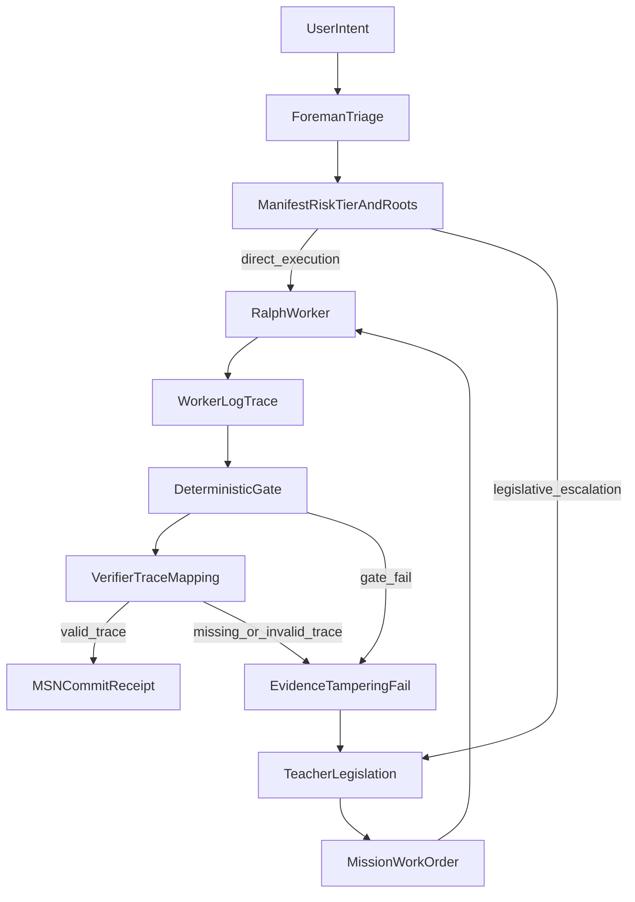

# OpenGantry `.gitagent/` (v0.5.0 — Forensic Truth)

This directory holds the **GXT substrate**: Foreman routing map, Teacher law, work-order template, and commit receipt shape. Application code lives elsewhere; this is the **governance + audit contract** for agent loops.

Treat **0.5.0** as **pre-1.0**: contracts are real enough to run teams on, but naming stays honest until `gapman` gains the remaining automation (history/receipt polish, etc.). The repo root **`gapman`** MVP CLI already covers `check`, `triage`, `mission`, and `verify` — see [README § gapman](../README.md#gapman-cli-mvp).

## Forensic Truth (what v0.5.0 means)

1. **Trace mapping** — A verifier **PASS** is not a vibe. Each PASS **MUST** cite a verbatim quote from **`WORKER_LOG.md`** plus a **line number or timestamp** from that file. If the quote is missing or not found in the log → **Evidence Tampering** → fail (see [`.gitagent/teacher/RULES.md`](teacher/RULES.md)). *This ensures execution integrity by decoupling what was intended from what actually occurred.*

2. **Risk tiers** — Per-skill **`trust_threshold`** in [`.gitagent/foreman/MANIFEST.json`](foreman/MANIFEST.json): Tier-1 allows single-provider automation when trace + gate pass; Tier-2 makes single-provider output **advisory** and requires human trace audit; Tier-3 wants multi-provider when possible else **mandatory human audit**.

3. **Dynamic TMVC** — Scope is **`tmvc_roots`** (recursive entry points), not necessarily every file listed. Anything **outside** the effective boundary needs a **Context Request** logged in `WORKER_LOG.md` before access. A **`forbidden_zone`** is not a soft limit: touching it without an approved, lawful path is a **security violation** — the loop **halts** (no merge, no “creative” bypass). The Verifier rejects the run; escalate to Teacher if policy needs to change.

4. **Git-native mission index** — No synthetic mission index in git. Use **`[MSN-XXXX]`** at the start of commit subjects and grep history with tools you already have, e.g. `git log --grep='MSN-0042'`.

5. **Local history** — Put bulky traces under **`.gitagent/history/`** (git-ignored). Optionally generate a local **`MISSION_LOG.md`** from `git log` when you need a readable rollup; do not commit large trace dumps to mainline.

6. **Branch `WORKER_LOG.md`** — With `git config core.hooksPath .githooks`, switching to a feature branch (not `main`/`master`) creates an empty repo-root **`WORKER_LOG.md`** from [`teacher/WORKER_LOG.template.md`](teacher/WORKER_LOG.template.md) if the file is absent. See [`.githooks/post-checkout`](../.githooks/post-checkout).

## Files (quick map)

| Path | Role |
|------|------|
| [`foreman/MANIFEST.json`](foreman/MANIFEST.json) | Map: `schema_version`, skills, `trust_threshold`, `tmvc_roots`, `forbidden_zones`, path risks |
| [`foreman/SOUL.md`](foreman/SOUL.md) | Foreman: manifest-only binary router |
| [`teacher/RULES.md`](teacher/RULES.md) | Law: SOD, trace rules, TMVC, Rule 4.4 manifest sync, tiers |
| [`teacher/MISSION.template.md`](teacher/MISSION.template.md) | Work order: DoD + trace table + TMVC roots |
| [`teacher/MISSION.schema.yaml`](teacher/MISSION.schema.yaml) | Structured mission schema (YAML) for `gapman mission validate` |
| [`teacher/MISSION.example.yaml`](teacher/MISSION.example.yaml) | Example structured mission |
| [`teacher/commit-template.md`](teacher/commit-template.md) | Greppable commit receipt with `[MSN-XXXX]` |
| [`teacher/WORKER_LOG.template.md`](teacher/WORKER_LOG.template.md) | Empty scaffold for repo-root `WORKER_LOG.md` (used by `.githooks/post-checkout`) |
| [`../.githooks/post-checkout`](../.githooks/post-checkout) | Hook: on feature-branch checkout, create `WORKER_LOG.md` if missing |

## Workflow (at a glance)

## Rule 4.4 (manifest sync)

If you change what a skill is or add/remove a skill entry, **update `MANIFEST.json` in the same commit set** as the skill change. Verifiers should fail on drift. The manifest is the **brain** (what is allowed to route where); skills are the **limbs** (who executes). Same commit set keeps them wired together.

## For automated agents (Cursor / CI)

Repo root [**`AGENTS.md`**](../AGENTS.md) and [`.cursor/rules/opengantry-gxt-substrate.mdc`](../.cursor/rules/opengantry-gxt-substrate.mdc) require reading **RULES** + **MANIFEST** before acting.

Continuous validation: **[`.github/workflows/gxt-validate.yml`](../.github/workflows/gxt-validate.yml)** — `gapman check` + unit tests after `npm ci`/`npm run build`; **`manifest`** via [`scripts/validate-gxt.sh`](../scripts/validate-gxt.sh) `manifest` (jq parity); **path-scoped `[MSN-NNNN]`** commit-subject check on **pull_request** only (see workflow header comment). Local: **`node dist/cli/index.js check`** plus **`./scripts/validate-gxt.sh`** (`manifest` | `msn <base> <head>` | `all …`).
