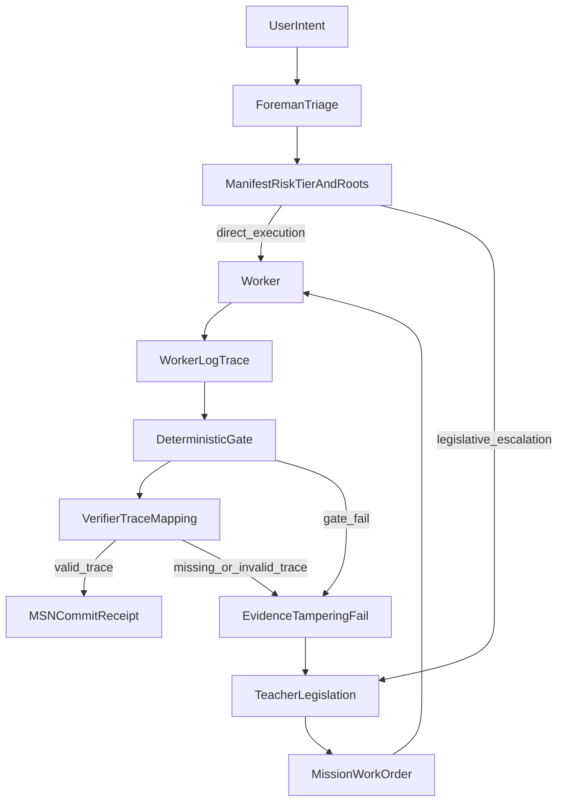

# OpenGantry `.gitagent/` (v1.1.1 — Execution-ready Forensic substrate)

This directory holds the **GXT substrate**: Foreman routing map, Teacher law, work-order schema, and commit receipt shape. Application code lives elsewhere; this is the **governance + audit contract** for agent loops.

Treat **0.5.0** as **pre-1.0**: contracts are real enough to run teams on, but naming stays honest until the protocol semver bumps. The repo root **`gapman` v1.1.1** CLI covers `init`, `check`, `doctor`, `triage`, `legislate` (YAML missions), `mission`, `runtime env`, `runtime exec`, `arch`, `metrics`, and `verify` — see [README § gapman](../README.md#gapman-cli).

## Forensic Truth (what v0.6.2 adds on v0.5.0)

1. **Trace mapping** — A verifier **PASS** is not a vibe. Each PASS **MUST** cite a verbatim quote from **`WORKER_LOG.md`** plus a **line number or timestamp** from that file. If the quote is missing or not found in the log → **Evidence Tampering** → fail (see [`.gitagent/teacher/RULES.md`](teacher/RULES.md)). *This ensures execution integrity by decoupling what was intended from what actually occurred.*

2. **Risk tiers** — Per-skill **`trust_threshold`** in [`.gitagent/foreman/MANIFEST.json`](foreman/MANIFEST.json): Tier-1 allows single-provider automation when trace + gate pass; Tier-2 makes single-provider output **advisory** and requires human trace audit; Tier-3 wants multi-provider when possible else **mandatory human audit**.

3. **Dynamic TMVC** — Scope is **`tmvc_roots`** (recursive entry points), not necessarily every file listed. Anything **outside** the effective boundary needs a **Context Request** logged in `WORKER_LOG.md` before access. A **`forbidden_zone`** is not a soft limit: touching it without an approved, lawful path is a **security violation** — the loop **halts** (no merge, no “creative” bypass). The Verifier rejects the run; escalate to Teacher if policy needs to change.

4. **Git-native mission index** — No synthetic mission index in git. Use **`[MSN-XXXX]`** at the start of commit subjects and grep history with tools you already have, e.g. `git log --grep='MSN-0042'`. **`gapman verify`** additionally requires a **Teacher stamp**: among the last **200** commits, the newest `[MSN-XXXX]` commit whose author is in **`GAPMAN_TEACHER_EMAILS`** (see [README § gapman](../README.md#gapman-cli-mvp)) must modify the mission file under **`.gitagent/missions/`**. **`gapman triage`** may emit non-binding **`adr_hints`** when ACTIVE ADR `match_terms` overlap intent; Teacher still resolves ADRs during legislation.

5. **Local history** — Put bulky traces under **`.gitagent/history/`** (git-ignored). Optionally generate a local **`MISSION_LOG.md`** from `git log` when you need a readable rollup; do not commit large trace dumps to mainline.

6. **Branch `WORKER_LOG.md`** — With `git config core.hooksPath .githooks`, switching to a feature branch (not `main`/`master`) creates an empty repo-root **`WORKER_LOG.md`** from [`teacher/WORKER_LOG.template.md`](teacher/WORKER_LOG.template.md) if the file is absent. See [`.githooks/post-checkout`](../.githooks/post-checkout).

7. **Worker Runtime (v0.7.0+)** — **`gapman runtime env --mission …`** emits the standard env contract ([`teacher/RUNTIME.md`](teacher/RUNTIME.md)) so external agents inherit `GXT_TMVC_ROOTS`, forbidden zones, and `GXT_WORKER_LOG` without hand-configuring each IDE. **`gapman runtime exec`** adds process-boundary forbidden-zone scanning (strongest TMVC trap). IDE Agent Write/Edit remains **advisory** unless wrapped in `runtime exec` — see [`docs/INTEGRATIONS.md`](../docs/INTEGRATIONS.md).

8. **Bootstrap + architecture (v1.1.1)** — **`gapman init`** installs this tree from packaged templates. **[`ARCHITECTURE.pointer.json`](ARCHITECTURE.pointer.json)** tells agents where code layout docs live; **`gapman arch cred`** stores git-ignored tokens for protected external sources. Primary mission format from **`gapman legislate`** is **YAML** under [`missions/`](missions/); Markdown missions remain supported for verify.

9. **Zero-trust + external IDE skills** — All file changes are untrusted until deterministic gates pass. Third-party agent skill packs are **local IDE edge only** (gitignored); optional `[SKILL-EXEC]` lines in `WORKER_LOG.md` are reviewer context, not verify evidence. See [`teacher/RUNTIME.md`](teacher/RUNTIME.md) and [`docs/DEVELOPMENT.md`](../docs/DEVELOPMENT.md).

## Files (quick map)

| Path | Role |
|------|------|
| [`foreman/MANIFEST.json`](foreman/MANIFEST.json) | Map: `schema_version`, skills, `trust_threshold`, `tmvc_roots`, `forbidden_zones`, path risks |
| [`ARCHITECTURE.pointer.json`](ARCHITECTURE.pointer.json) | Agent discovery for code layout (`kind`, `location`, `read_hint`, optional `access`) |
| [`teacher/ARCHITECTURE-DISCOVERY.md`](teacher/ARCHITECTURE-DISCOVERY.md) | When architecture is **unset** or stub — ask user; never invent layout |
| [`teacher/ARCHITECTURE-ACCESS.md`](teacher/ARCHITECTURE-ACCESS.md) | Authenticated external architecture sources |
| [`foreman/SOUL.md`](foreman/SOUL.md) | Foreman: manifest-only binary router |
| [`teacher/RULES.md`](teacher/RULES.md) | Law: SOD, trace rules, TMVC, Rule 4.4 manifest sync, tiers |
| [`teacher/RUNTIME.md`](teacher/RUNTIME.md) | Worker Runtime Contract: env vars emitted by **`gapman runtime env`** |
| [`teacher/MISSION.example.yaml`](teacher/MISSION.example.yaml) | Primary structured mission example (YAML; `legislate` default) |
| [`teacher/MISSION-ARCHITECT.md`](teacher/MISSION-ARCHITECT.md) | IDE chat Teacher-Assistant: fast-path + legislate-only handoff |
| [`teacher/MISSION.schema.yaml`](teacher/MISSION.schema.yaml) | Structured mission schema (YAML) for `gapman mission validate` |
| [`teacher/MISSION.template.md`](teacher/MISSION.template.md) | Human-readable Markdown reference (verify accepts md+yaml) |
| [`teacher/commit-template.md`](teacher/commit-template.md) | Greppable commit receipt with `[MSN-XXXX]` |
| [`teacher/WORKER_LOG.template.md`](teacher/WORKER_LOG.template.md) | Empty scaffold for repo-root `WORKER_LOG.md` (used by `.githooks/post-checkout`) |
| [`missions/README.md`](missions/README.md) | Canonical mission file location for `gapman verify` git-proof |
| [`out-of-scope/README.md`](out-of-scope/README.md) | ADR-style decisions — **Teacher context only**; Foreman does not read |

## Workflow (at a glance)

## Rule 4.4 (manifest sync)

If you change what a skill is or add/remove a skill entry, **update `MANIFEST.json` in the same commit set** as the skill change. Verifiers should fail on drift. The manifest is the **brain** (what is allowed to route where); skills are the **limbs** (who executes). Same commit set keeps them wired together.

## For automated agents (Cursor / CI)

Repo root [**`AGENTS.md`**](../AGENTS.md) and [`.cursor/rules/opengantry-gxt-substrate.mdc`](../.cursor/rules/opengantry-gxt-substrate.mdc) require reading **RULES** + **MANIFEST** before acting.

**Developing this repository:** follow **[`docs/DEVELOPMENT.md`](../docs/DEVELOPMENT.md)** — missions, hooks, `gapman verify`, and **`npm run validate`** (full local stack).

Continuous validation: **[`.github/workflows/gxt-validate.yml`](../.github/workflows/gxt-validate.yml)** — `gapman check`, `gapman doctor`, and unit tests after `npm ci`/`npm run build`; **`manifest`** via [`scripts/validate-gxt.sh`](../scripts/validate-gxt.sh) `manifest` (jq parity); **changed-code quality** on PRs; **path-scoped `[MSN-NNNN]`** commit-subject check on **pull_request** only (see workflow header comment). Local superset: **`npm run validate`** or **`./scripts/dev-validate.sh`**. Workers can preload scope with **`gapman runtime env --mission … --json`**.
