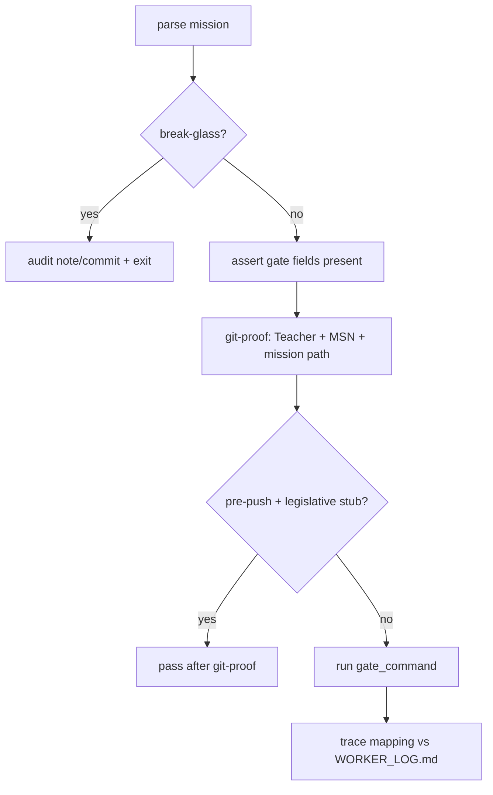
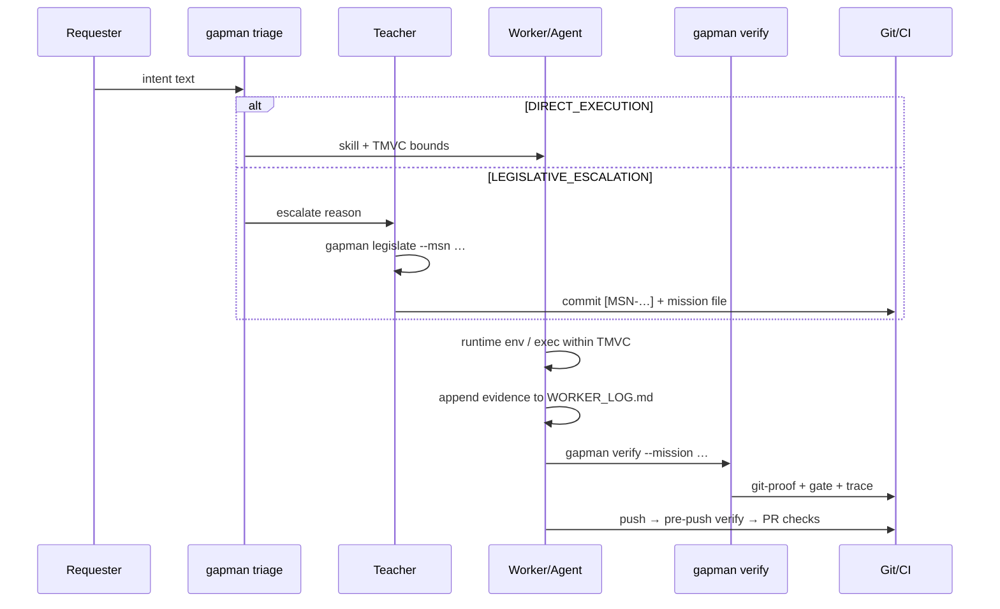

# OpenGantry Project Outline (Inferred from Implementation)

## Scope of this analysis

This document describes what the project **actually does today**, reconstructed from executable code, tests, repository layout, hooks, CI scripts, and packaged templates. Narrative docs (`README.md`, `.gitagent/README.md`, etc.) are **not** treated as source of truth; a separate section compares them against the implementation and notes gaps.

**Method:** read `src/cli/**`, `templates/**`, `.githooks/**`, `.cursor/hooks/**`, `scripts/**`, `.github/workflows/**`, and the on-disk substrate (`.gitagent/`, `skills/`).

---

## Physical reality: what this repository is

| Fact | Evidence |
|------|----------|
| **Not an application server** | No HTTP server, no database layer, no frontend app in `src/`. |
| **Single shipped codebase** | All TypeScript lives under `src/cli/` (~90 files). Built to `dist/cli/index.js`; exposed as `gapman` via `package.json` `bin`. |
| **Dual role: dogfood specimen + bootstrap kit** | This repo runs GXT on itself (`.gitagent/`, hooks, missions) while also shipping `templates/` for `gapman init` to copy into other repos. |
| **Node 24+ CLI tool** | `engines.node >= 24`; dependencies: `commander`, `yaml`, `@clack/prompts`. |
| **Version on disk** | `package.json` / CLI: **0.8.1**; manifest `schema_version`: **0.5.0**. |

In plain terms: **OpenGantry is a Git-native governance substrate and a TypeScript CLI (`gapman`) that enforces, bootstraps, and instruments AI-assisted engineering workflows.**

---

## The `gapman` CLI — complete command surface (from code)

Commands are registered in `program-core.ts`, `program-arch.ts`, `program-mission.ts`, and `program-workflow.ts`.

### Core / bootstrap

| Command | What it actually does |
|---------|----------------------|
| **`gapman check`** | Validates `MANIFEST.json` shape and **Rule 4.4**: every manifest skill key must have `skills/<key>.md`, with no orphan skill files. |
| **`gapman status`** | Human-readable report of the same sync checks. |
| **`gapman doctor`** | Readiness probe: manifest/skills sync, `GAPMAN_TEACHER_EMAILS`, bypass anchor state, `core.hooksPath`, example mission presence, architecture pointer health, integration file staleness vs `templates/integrations/compatibility.json`. Warnings exit 0; hard fails exit 1. |
| **`gapman init`** | Copies packaged assets from `templates/` into the target git repo. Supports interactive wizard (`@clack/prompts`), `--yes` default profile, `--dry-run`, IDE selection, skills preset (`minimal` \| `specimen`), hooks/CI toggles, architecture pointer composition. Asset modes: `scaffold_only` (create-if-missing) vs `managed_strict` (prompt/force overwrite). Also merges `.gitignore.gxt` lines and composes `docs/INTEGRATIONS.md` + `.gitagent/ARCHITECTURE.pointer.json`. |
| **`gapman triage "<intent>"`** | Manifest-only routing (`triage-logic.ts`): escalate on `path_risks` / `risk_keywords` match, or ambiguous/zero skill matches; else `DIRECT_EXECUTION` with one skill. Optional non-binding `adr_hints` from `.gitagent/out-of-scope/`. Can `--emit-mission` (markdown) on direct execution only. |

### Architecture discovery (v0.8.x)

| Command | What it actually does |
|---------|----------------------|
| **`gapman arch pointer`** | Prints summary of `.gitagent/ARCHITECTURE.pointer.json` (`kind`, `location`, access/discovery skills). |
| **`gapman arch cred status\|set\|unset`** | Git-ignored credential slots under `.gitagent/history/credentials/` for authenticated external architecture sources. Secrets via stdin only. |

Pointer kinds: `unset` \| `file` \| `directory` \| `external`. Stub detection uses marker strings in architecture files; `doctor` warns when agents must ask before implementing.

### Mission lifecycle

| Command | What it actually does |
|---------|----------------------|
| **`gapman legislate "<intent>" --msn MSN-NNNN`** | Writes YAML mission under `.gitagent/missions/` with placeholder gate (`echo OK`), placeholder trace quote, derived or `--skill-key` skill. Fails if triage would escalate without override. Duplicate `msn_id` fails unless `--allow-duplicate`. Teacher must still `git commit` with `[MSN-…]` subject. |
| **`gapman mission validate --file <path>`** | Parses mission markdown or YAML; validates against in-app rules + schema file presence. |
| **`gapman mission snapshot --file <path>`** | Writes JSON snapshot to `.gitagent/history/`: HEAD, branch, dirty flag, manifest hash, hashes of files under skill TMVC roots. |
| **`gapman runtime env --mission <path>`** | Emits `GXT_*` env (`GXT_REPO_ROOT`, `GXT_MISSION_FILE`, `GXT_MSN_ID`, `GXT_SKILL_KEY`, `GXT_TMVC_ROOTS`, `GXT_FORBIDDEN_ZONES`, `GXT_WORKER_LOG`, `GXT_LAST_ERROR_FILE`) as shell exports, text lines, or JSON. |
| **`gapman runtime exec --mission <path> -- <cmd…>`** | Orchestrated worker run: loads mission env, writes structured telemetry to worker log, runs subprocess with optional timeout/streaming, scans forbidden-zone file touches before/after, writes agent error JSON on failure. |

### Verification and observability

| Command | What it actually does |
|---------|----------------------|
| **`gapman verify --mission <path>`** | Multi-stage gate (see below). Supports `--pre-push` (legislative stubs stop after git-proof), `--strict-trace` / `--fuzzy-trace`, `--break-glass` with `GXT_BYPASS_SECRET` + audit note/commit. |
| **`gapman metrics [--json] [--ref HEAD]`** | Git-native rollup from streamed `git log`: mission IDs, bypass note count, legislative vs worker-trace commit heuristics, turnaround stats. No local event ledger. |

---

## Verification model (center of gravity)

`verify.ts` orchestrates `verify-flow.ts` modules in order:

### 1. Git proof (`git-proof.ts`)

- Mission file must live under `.gitagent/missions/`.
- Requires `GAPMAN_TEACHER_EMAILS` (comma-separated author emails).
- Finds recent commits whose **subject line** starts with `[MSN-NNNN]`.
- Teacher commit must touch the mission file path.

### 2. Deterministic gate (`gate.ts`)

- Runs mission `gate_command`; must exit 0.
- Optional `gate_success_substring` checked in combined stdout/stderr.

### 3. Trace mapping (`trace.ts`)

- For rows with PASS status: verbatim `trace_quote` must exist in `WORKER_LOG.md`.
- `anchor` validated against line number or co-located token.
- **Default:** auto line-drift resolution when quotes match but line numbers shifted (`--strict-trace` disables).

### 4. Legislative stubs (`mission-legislative-stub.ts`)

- Missions from `legislate` ship with placeholder trace quote `REPLACE_WITH_VERBATIM_QUOTE_FROM_WORKER_LOG_AFTER_EXECUTION`.
- `verify --pre-push` passes these after git-proof only — enabling remote agent handoff before worker execution.

### 5. Break-glass (`break-glass.ts`)

- `GXT_BYPASS_SECRET` must SHA-256-match a line in `.gitagent/foreman/BYPASS.sha256`.
- Writes git note (or empty audit commit) with reason; skips gate and trace.

---

## Triage / routing (actually implemented)

` t triageIntent()` is **heuristic string matching**, not ML:

1. Lowercase intent text.
2. **Escalate** if intent mentions any `path_risks` key or `risk_keywords` entry.
3. Else match manifest skill keys (full key or first hyphen segment) in intent.
4. **0 matches** → escalate; **1 match** → direct execution; **>1** → escalate.

Skill boundaries come entirely from `MANIFEST.json` per skill: `tmvc_roots`, `forbidden_zones`, `trust_threshold`.

---

## Bootstrap: `gapman init` asset catalog

`init-asset-catalog.ts` defines what gets copied:

| Category | Examples |
|----------|----------|
| **Core substrate** | `.gitagent/foreman/MANIFEST.json`, `RULES.md`, mission README, `AGENTS.md`, architecture discovery/access docs, `MISSION.schema.yaml`, `validate-gxt.sh` |
| **Skills** | `skills/ui.md`, `logic.md` (minimal); + `gapman.md`, `substrate.md` (specimen) |
| **Hooks** | `.githooks/post-checkout`, `pre-push` |
| **CI** | `.github/workflows/gxt-validate.yml` |
| **Runtime scripts** | `gxt-runtime-env.sh`, `gxt-resolve-mission.sh`, `gxt-pin-mission.sh`, `gxt-cursor-env.sh` |
| **Cursor** | rules mdc, `hooks.json`, session-start + before-shell guards |
| **IDE packs** | Claude, Codex, OpenCode, Junie, Antigravity, Cline, Aider, OpenHands pointer files |

Init composes:

- **`docs/INTEGRATIONS.md`** (or custom path) from recipe templates + `compatibility.json` (9 integrations, version 0.8.1).
- **`.gitagent/ARCHITECTURE.pointer.json`** from wizard flags (`--arch-source`, `--arch-location`).

---

## Agent / IDE integration layer (beyond CLI)

Implemented in shell + Cursor hooks, not in TypeScript policy:

| Mechanism | Behavior |
|-----------|----------|
| **`scripts/gxt-pin-mission.sh`** | Writes gitignored `.gitagent/missions/.active-mission` pointer. |
| **`scripts/gxt-resolve-mission.sh`** | Resolves pinned mission for hooks. |
| **`.cursor/hooks/gxt-session-start.sh`** | On Cursor session start: load pinned mission → `gapman runtime env --json` → inject `GXT_*` env + context into agent. |
| **`.cursor/hooks/gxt-before-shell.sh`** | Prompts before shell commands touching `.gitagent/foreman/` or `RULES.md`. |
| **`AGENTS.md` + rules mdc** | Instruct agents to read RULES + MANIFEST (+ architecture pointer) before acting. |

**Important:** TMVC enforcement in the IDE is **advisory** (rules + hook prompts). Hard enforcement is CLI-side (`verify`, `runtime exec` forbidden scan, CI/hooks calling `gapman`).

---

## Repository enforcement (hooks + CI)

### `.githooks/pre-push`

For each changed mission file on branch vs merge-base:

- `gapman verify --mission … --pre-push`

Also:

- `gapman check` if `MANIFEST.json` or `skills/` changed
- `scripts/check-changed-code.sh` if `src/cli/**/*.ts` changed (ESLint complexity, import layers, line budgets)

### `.githooks/post-checkout`

On feature branch checkout: seed `WORKER_LOG.md` from template if missing (never overwrite).

### GitHub Actions (`gxt-validate.yml`)

| Job | Runs |
|-----|------|
| `manifest` | build, `gapman check`, `validate-gxt.sh manifest`, unit tests |
| `code_quality` (PR only) | changed-code script |
| `msn_commits` (PR only) | path-scoped `[MSN-NNNN]` subject check via `validate-gxt.sh msn` |

### Local dogfood (`scripts/dev-validate.sh`)

Build + check + manifest + tests + **doctor** + changed-code + MSN — stricter than CI (doctor not in workflow).

---

## Data contracts (on-disk)

| Artifact | Role |
|----------|------|
| `.gitagent/foreman/MANIFEST.json` | Skills, TMVC roots, forbidden zones, path risks, risk keywords |
| `.gitagent/missions/*.yaml` (or `.md`) | Work orders: MSN, skill, gate, trace rows |
| `WORKER_LOG.md` | Worker-authored forensic evidence (quote source for verify) |
| `.gitagent/ARCHITECTURE.pointer.json` | Where agents find code layout docs |
| `skills/<key>.md` | Per-skill agent instructions; must mirror manifest keys |
| `.gitagent/history/` | Snapshots, credentials (gitignored), agent errors |

---

## End-to-end workflow (as the code expects it)

---

## What this project is **not** (despite substrate specimen paths)

- **Not a multi-skill application codebase.** The specimen `MANIFEST.json` lists `ui` → `src/components/`, `logic` → `src/lib/` + `src/utils/`, but **those directories do not exist** in this repo. Real dogfood work routes through the `gapman` skill → `src/cli/`.
- **Not a hosted governance service.** All state is local files + git history + optional git notes.
- **Not cryptographic attestation.** Trace mapping verifies verbatim quotes in a worker-controlled log — process control, not tamper-proof proof.
- **Not published npm package today.** `private: true`; distribution is copy/subtree/vendor + local build.

---

## Test coverage signal

~18 test modules under `src/cli/tests/` covering: triage, legislate, verify, git-proof, trace/gate, runtime exec, init, doctor, metrics, break-glass, architecture pointer/credentials, mission parsing, legislative stubs, dirty missions, validate-gxt shell parity.

---

## Documentation misalignments (implementation vs docs)

Findings from comparing code to narrative docs at analysis time, with **status after v0.8.1 narrative sync** (2026-05-19):

| Topic | Code reality | Was | Status after sync |
|-------|--------------|-----|-------------------|
| **CLI version** | `0.8.1` in `package.json`, `program.ts`, `compatibility.json` | README broadcast **gapman v0.7.0** | **Resolved** — README, `.gitagent/README.md`, relationship footer now say **v0.8.1** |
| **Command inventory** | Full surface includes `init`, `doctor`, `arch *`, `runtime exec`, `metrics` | README table omitted key v0.8.x commands | **Resolved** — README command table is complete |
| **Specimen MANIFEST paths** | `ui`/`logic` TMVC roots point at hypothetical app dirs | Easy to misread as this repo's layout | **Open** — specimen `MANIFEST.json` unchanged; docs now init-first; adopters must customize post-`init` |
| **Mission format emphasis** | `legislate` emits **YAML**; verify accepts md+yaml | README centered Markdown templates | **Resolved** — YAML primary; `MISSION.template.md` demoted to reference |
| **CI vs local validate** | Both run core checks; local adds changed-code + MSN vs `origin/main` | CI lacked `gapman doctor` | **Resolved** — doctor added to workflow; DEVELOPMENT.md documents superset vs CI |
| **Runtime exec** | First-class orchestration with telemetry + forbidden scan | Underdocumented in README | **Resolved** — README table + quickstart + ADOPTION loop |
| **Architecture pointer** | init, doctor, arch cred, agent rules | Buried in late README prose | **Resolved** — promoted in What you get, init flow, command table |
| **Integration count** | 9 tools in `compatibility.json` | Generally matched | **Resolved** — unchanged; doctor integration checks remain live source of truth |
| **Forbidden zone enforcement** | `runtime exec` scans filesystem; IDE rules advisory | TMVC read as uniformly enforced | **Resolved** — Enforcement boundary callout in README + ADOPTION; INTEGRATIONS unchanged |
| **Metrics semantics** | `legislative_commits` / `worker_trace_commits` are heuristics | Easy to over-interpret | **Open** — ADOPTION caveat retained; no change needed |

**Remaining narrative debt:** specimen `MANIFEST.json` still lists hypothetical app paths (`src/lib/`, `src/components/`) — intentional for adopters, not this repo's actual `src/cli/` layout.

---

## Maturity assessment (from code shape)

**Strengths**

- Coherent closed loop: triage → legislate → runtime env → worker log → verify.
- Fail-closed verification with actionable `Fix:` hints (`user-error.ts`, `fix-hints.ts`).
- Bootstrap path (`init`) makes the substrate portable without assuming this repo's layout.
- Layered CLI architecture with import-layer CI enforcement (`check-import-layers.mjs`).
- Legislative stub + `--pre-push` models realistic remote-agent handoff.

**Deliberate simplifications**

- Triage is substring heuristics — will escalate often on ambiguous intents.
- Governance trust model is Git identity + file conventions, not signed artifacts.
- Application architecture in manifest is **adopter-configured fiction** until customized post-`init`.

**Likely evolution pressure**

- Fetching `external` architecture pointers (pointer exists; no HTTP client in CLI yet).
- Richer mission schema validation at runtime.
- Stronger IDE-side TMVC enforcement (today mostly advisory except `runtime exec` scan).
- Clarify specimen vs dogfood MANIFEST paths in onboarding (optional manifest comment or dogfood overlay).

---

## Bottom line

**As implemented today**, OpenGantry is a **portable GXT governance kit** plus a **Node CLI** that:

1. **Bootstraps** substrate + multi-IDE integration files into any git repo (`init`).
2. **Routes** work via manifest heuristics (`triage`).
3. **Legislates** scoped missions with Teacher git accountability (`legislate`, git-proof).
4. **Bootstraps agent runtime** with explicit TMVC/forbidden boundaries (`runtime env`, Cursor hooks, pin scripts).
5. **Optionally orchestrates** worker commands with telemetry (`runtime exec`).
6. **Refuses unverified success claims** unless gate output and `WORKER_LOG.md` quotes align (`verify`).
7. **Enforces** policy at push/PR time via hooks, CI, and MSN-scoped commit subjects.

It is **not** an application under test — it is the **control plane** for how applications (or, in this repo, the CLI itself) get changed under AI-assisted workflows.
