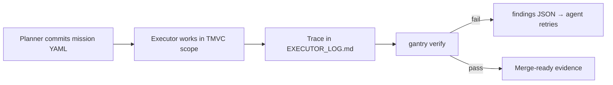

<p align="center">
  <a href="https://opengantry.ai"></a>
</p>

# OpenGantry: What It Is, Why It Exists, and How to Use It

## The one-line pitch

**OpenGantry is a local-first CLI that scopes agent edits, runs your shell gates, and returns structured failure JSON so agents can retry without a human watching the terminal.** It does not write your code or content for you. It replaces humans babysitting AI coding assistants — not your tests, not your CI, not your code review.

> **Not [Gantry.io](https://gantry.io)?** OpenGantry is the open-source **`gantry` CLI** for local-first, Git-native agent enforcement in your repository, not a hosted observability dashboard. Product home: [opengantry.ai](https://opengantry.ai).

### Start the audit trail now

Agent velocity without a declared mission trail means you reverse-engineer years of edits when auditors ask. OpenGantry is the tool you run **today** so continuous, Git-native mission traces and attestation receipts already exist. Same loop that keeps local agents from thrashing VRAM on unstructured stderr or wandering outside declared paths: 100% local, fast, and offline. No cloud required for verify.

Deep dive: [`docs/SECURITY.md`](docs/SECURITY.md) · [`docs/FEATURES.md`](docs/FEATURES.md) · [opengantry.ai](https://opengantry.ai)

---

## In plain English

OpenGantry uses product terms that sound abstract. Here is what the CLI actually runs:

| Term you will see | What it actually is |
|-------------------|---------------------|
| **Contract** | Mission YAML under `.gitagent/missions/` — allowed paths, forbidden paths, and a required `gate_command` (shell) |
| **Legislate** | `gantry legislate` / Mission Architect writes that YAML; a Planner commit locks it in Git before work |
| **Governance** | Hooks + `gantry verify` that fail closed if scope or gates are violated — not a process committee |
| **Verdict** | Deterministic pass/fail from shell gates + trace checks; on fail, a `findings[]` JSON envelope |

**"Contract" is not design-by-contract (DbC).** It is not pre/post conditions in source code. It is the Git-locked work order that tells the agent where it may edit and which shell command must pass before merge.

---

## Why not just TDD and CI?

You already have `npm test` and GitHub Actions. OpenGantry does not replace them — it makes them usable when an **AI agent** runs the loop.

| Who runs the loop | What happens on failure |
|-------------------|-------------------------|
| **Human developer** | Reads stderr, parses the stack trace, rewrites code |
| **AI agent + raw TDD/CI** | Chokes on unstructured stderr, hallucinates fixes, spins in retry loops — a senior still babysits |
| **AI agent + OpenGantry** | Same gates you already trust; `gantry verify --json` returns `findings[]` with file, line, and hint so the agent can self-correct |

| Already have | Still missing for autonomous agents | OpenGantry adds |
|--------------|-------------------------------------|-----------------|
| `npm test` / GH Actions | Structured failure for model retry | `findings[]` envelope |
| PR CI | Declared edit blast radius | TMVC + forbidden zones in mission YAML |
| Code review | Proof the agent stayed in scope | Git mission + `EXECUTOR_LOG.md` quotes |

---

## Vision

Most AI agent tooling optimizes for *speed of generation*. OpenGantry optimizes for **trust at scale**:

- **Scope before execution:** no silent edits to governance files, no wandering outside approved paths
- **Deterministic verification:** gates are shell commands with pass/fail outcomes, not LLM opinions
- **Forensic trace:** every mission ties to `[MSN-XXXX]` commits and verbatim quotes in `EXECUTOR_LOG.md`
- **Domain-agnostic:** the same loop governs TypeScript imports *and* brand/compliance copy

The long-term bet: external executors (Cursor agents, Hermes, CI bots) do the work; **OpenGantry owns the mission YAML and the verify output**. That separation is what makes agentic delivery auditable in regulated or security-sensitive environments.

---

## What problem it solves

Without governance glue, agent-assisted repos tend toward:

| Problem | OpenGantry answer |
|---------|-------------------|
| Agents edit `.gitagent/` or manifest silently | Git hooks + `gantry verify` fail closed |
| "It passed locally" with no proof | `gate_command` + trace quotes verifiers must cite |
| Architecture drift | `TARGET_ARCHITECTURE.yaml` + `gantry arch check` / `gantry perimeter check` |
| Opaque failures for retry loops | `findings[]` JSON envelope (file, line, hint); no terminal log parsing |
| One-off policy per repo | `gantry init` scaffolds the same GXT substrate everywhere |

---

## The core loop (GXT)

Everything revolves around a **mission**:



**Roles:**

- **Planner:** human (or Mission Architect in chat) commits mission YAML via `gantry legislate` before execution
- **Executor:** agent or developer edits within TMVC roots; forbidden zones respected
- **Verifier:** `gantry verify` checks gate output and trace mapping

**Key artifacts in your repo:**

| File | Role |
|------|------|
| `.gitagent/missions/MSN-XXXX.yaml` | Scope, `gate_command`, trace rows |
| `.gitagent/foreman/MANIFEST.json` | Skill routing, TMVC roots, risk tiers |
| `.gitagent/planner/RULES.md` | Governance law (Tier-3, Planner-only) |
| `EXECUTOR_LOG.md` | Verbatim PASS quotes for verify |
| `TARGET_ARCHITECTURE.yaml` | Perimeter rules (imports or regex) |

---

## Three phases, any domain

OpenGantry is a **domain-neutral verify loop**, not just a TypeScript linter:

| Phase | Command | Output |
|-------|---------|--------|
| **Context ingestion** | `gantry init --discover --domain code\|content` | `.gitagent/discovery-proposal.json` |
| **Rules of engagement** | `gantry blueprint --domain code\|content` | `ARCHITECTURE.md`, `TARGET_ARCHITECTURE.yaml`, `verification_plan.json` |
| **Standardized audit API** | `gantry verify --json` | `findings[]` failure envelope |

### Built-in domain adapters

| Domain | Corpus | Enforcement |
|--------|--------|-------------|
| `code` | `.ts`, `.js`, … | Import layers, forbidden specifiers |
| `content` | `.md`, `.html`, `.txt`, … | `forbid_pattern`, `require_pattern` regex |

List them: `gantry domains`

**Binary enforcement:** pass/fail only — no LLM opinions at the gate. Content discovery uses exact-match boilerplate only; it does not infer "dominant terminology" from statistics that would flip on unrelated edits.

See [`docs/DOMAINS.md`](docs/DOMAINS.md) for adapter details and [`docs/AGENT-LOOP.md`](docs/AGENT-LOOP.md) for external executor integration.

---

## Feature tour: what to try first

### 1. Bootstrap a repo

```bash
npm install -g @jeger-ai/opengantry
gantry init --tutorial
```

Scaffolds `.gitagent/`, hooks, manifest, and walks you through the first mission loop.

### 2. Fast-path discovery

```bash
gantry init --discover --domain code      # scan TS/JS imports
gantry init --discover --domain content   # scan markdown corpora
```

Emits a proposal with evidence-anchored conventions and anomalies (`file:line` snippets). Nothing becomes law until a human confirms or runs blueprint.

**Speed:** the discovery scanner uses streaming regex per file, not a whole-repo AST. It is budgeted to finish a **5,000-file monorepo in under five seconds** (pinned in CI). OpenGantry ingests repository context in seconds without loading the tree into a heavy compiler graph or spiking RAM. Enterprise teams do not have to wait minutes for a governance tool to "understand" the repo before the agent loop starts.

### 3. Blueprint: lock rules and gate commands

```bash
gantry blueprint --domain content --yes
```

Produces three artifacts:

- **`ARCHITECTURE.md`:** human-readable decisions with evidence links
- **`TARGET_ARCHITECTURE.yaml`:** machine-checkable rules (schema 0.3.0 for content)
- **`.gitagent/verification_plan.json`:** `gate_commands` and `required_skills` gaps

The executor agent reads `required_skills` and builds missing tooling *before* coding.

### 4. Perimeter enforcement

```bash
gantry arch check              # code: import/layer rules
gantry perimeter check         # domain-neutral alias (same engine)
```

For content, rules look like:

```yaml
forbid_pattern: "(?i)cures cancer"
require_pattern: "These statements have not been evaluated by the FDA"
```

Violations carry `file` and `line` for the failure envelope.

### 5. Mission + verify

```bash
gantry legislate "add feature X" --msn MSN-0042 --skill-key gantry
# Planner commits [MSN-0042] mission YAML
eval "$(gantry runtime env --mission .gitagent/missions/MSN-0042.yaml)"
# ... do work, append trace to EXECUTOR_LOG.md ...
gantry verify --mission .gitagent/missions/MSN-0042.yaml --json
```

On failure, external agents ingest `findings[]`:

```json
{
  "failed_gate": "arch",
  "offending_file": "content/ad-bad.md",
  "line": 3,
  "severity": "error",
  "resolution_hint": "..."
}
```

**No terminal vomit:** agents do not scrape unstructured stderr or guess which line failed. The `findings[]` envelope is a **predictable, structured audit API** built for autonomous retry loops: each item names the gate, file, line, severity, and a resolution hint. Same payload on `--json`, SARIF, and MCP `gxt_verify`.

### 6. Content governance example

See [`examples/content-governance/`](examples/content-governance/). Ad copy with seeded violations (forbidden claim, missing disclaimer, wrong brand hex). Same loop as code; different adapter.

### 7. IDE integration

- **Cursor MCP:** `gxt_draft_legislation`, `gxt_verify`, `gxt_pin_mission`
- **Hooks:** session start loads pinned mission; shell guards block unscoped substrate writes
- Details: [`docs/INTEGRATIONS.md`](docs/INTEGRATIONS.md)

---

## What OpenGantry is *not*

- **Not an agent:** it does not chat, plan features, or generate PRs by itself
- **Not Gantry.io:** no hosted observability dashboard; everything runs in your repo
- **Not an LLM judge for merge:** gates stay deterministic; optional LLM evidence is committed separately via `gantry scan`

---

## Mental model for adopters

```
OpenGantry = scoped work order + shell gates + structured verify output
Executor agent = worker (Cursor, Hermes, human dev)
```

You adopt OpenGantry when agent velocity is valuable but **unreviewed scope creep, silent governance edits, or unverifiable "it works" claims** are unacceptable.

---

## Documentation map {#documentation-map-start-here}

Full doc index: [`docs/index.md`](docs/index.md) — organized by **how**, **what**, and **why**.

## Where to go next

| Goal | Doc |
|------|-----|
| All documentation | [`docs/index.md`](docs/index.md) |
| What it helps with | [`docs/USE-CASES.md`](docs/USE-CASES.md) |
| Why features exist | [`docs/FEATURES.md`](docs/FEATURES.md) |
| Adoption runbook | [`docs/ADOPTION.md`](docs/ADOPTION.md) |
| Release history | [`docs/CHANGELOG.md`](docs/CHANGELOG.md) |
| Domain adapters | [`docs/DOMAINS.md`](docs/DOMAINS.md) |
| External agent integration | [`docs/AGENT-LOOP.md`](docs/AGENT-LOOP.md) |
| Contributing / dogfooding this repo | [`docs/DEVELOPMENT.md`](docs/DEVELOPMENT.md) |
| Content walkthrough | [`examples/content-governance/`](examples/content-governance/) |
