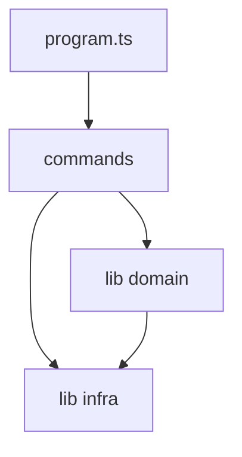

# gantry CLI architecture

Layered layout for [`src/cli/`](../src/cli/). Agents locate this file via [`.gitagent/ARCHITECTURE.pointer.json`](../.gitagent/ARCHITECTURE.pointer.json) (`kind: file`). Dependencies flow **downward only** (higher layers may import lower; never the reverse).

## Layers

| Layer | Paths | Responsibility |
|-------|--------|----------------|
| **CLI delivery** | `src/cli/index.ts`, `src/cli/program.ts`, `src/cli/commands/**` | argv, stdin, exit codes, human output |
| **Application** | `*orchestrator*.ts`, `commands/*` orchestration | compose domain steps into use-cases |
| **Domain** | `mission-*.ts`, `trace.ts`, `triage-logic.ts`, `git-proof.ts`, `gate.ts`, `manifest.ts`, … | policy and pure rules |
| **Infrastructure** | `git-repo.ts`, `git.ts`, `runtime-exec-process.ts` | git, subprocess, FS |
| **Governance surface** | `.githooks/`, `scripts/`, `.github/workflows/` | shell out to `gantry`; no duplicated policy |

## Import rules (enforced in CI for changed files)

1. `src/cli/lib/**` MUST NOT import from `src/cli/commands/**`.
2. `src/cli/commands/**` MUST NOT import `runtime-exec-process.ts` directly (use `runtime-exec.js`).
3. Domain modules SHOULD NOT import `commander`.
4. Hooks and shell scripts MUST NOT reimplement MSN/git-proof logic; call `gantry`.

## Complexity budgets (changed `.ts` only)

| Rule | Production `src/cli` | Tests `src/cli/tests` |
|------|----------------------|---------------------|
| Max file lines | 450 | 900 |
| Max function lines | 80 | 120 |
| ESLint complexity | 20 | 25 |

Grandfathered paths (full-file exempt until refactored) live in [`.gxt-quality-baseline.json`](../.gxt-quality-baseline.json).

## Definition of done

OpenGantry contributors use the **full GXT stack** — see [`docs/DEVELOPMENT.md`](DEVELOPMENT.md).

- `npm run validate` (build, `gantry check`, tests, doctor, changed-code, MSN subjects)
- Mission + Teacher `[MSN-…]` commit when GXT or CLI behavior changes
- `gantry verify --mission …` with matching `WORKER_LOG.md` trace
- No new duplicate `gitSpawn` helpers (use [`git-repo.ts`](../src/cli/lib/git-repo.ts))
